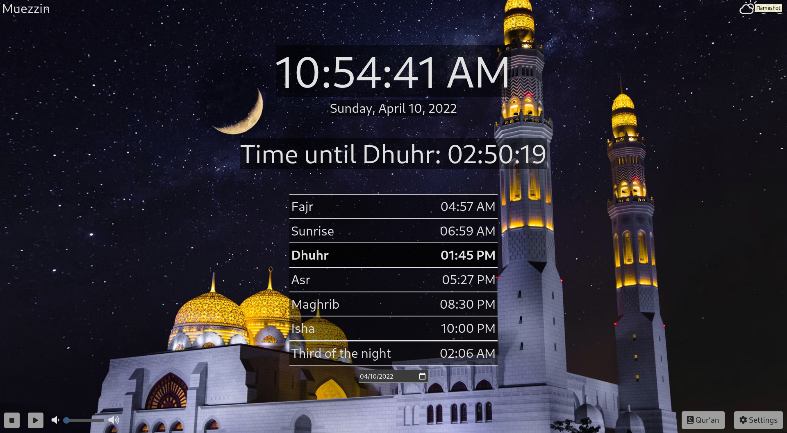
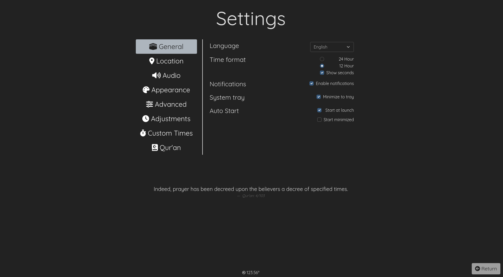
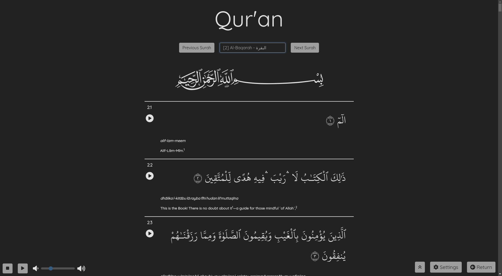

# Muezzin

<!-- PROJECT LOGO -->
 

  

  <h3 align="center">Muezzin - مؤذن</h3>

  

    A prayer times and Adhan application for Windows, macOS and GNU/Linux 
     
    <a href="https://github.com/DBChoco/MuezzinPrayerTimes/releases/latest"><strong>Download »</strong></a>
     
     
    <a href="https://github.com/DBChoco/MuezzinPrayerTimes">View Demo</a>
    ·
    <a href="https://github.com/DBChoco/MuezzinPrayerTimes/issues">Report Bug</a>
    ·
    <a href="https://github.com/DBChoco/MuezzinPrayerTimes/issues">Request Feature</a>
  

  
  
  
  
  
  
   
  
  
  
  

<!-- TABLE OF CONTENTS -->
## Table of Contents
  

<ul>
  <li><a href="#muezzin">Muezzin</a>
    <ul>
      <li>
        <a href="#about-the-project">About The Project</a>
        <ul>
          <li><a href="#supported-languages">Supported Languages</a></li>
          <li><a href="#built-with">Built With</a></li>
          <li><a href="#roadmap">Roadmap</a></li>
        </ul>
      </li>
      <li>
        <a href="#how-to-install">How To Install</a>
        <ul>
          <li><a href="#windows">Windows</a></li>
          <li><a href="#macos">macOS</a></li>
          <li><a href="#gnulinux">GNU/Linux</a>
            <ul>
              <li><a href="#global">Global</a></li>
              <li><a href="#arch-based-distributions">Arch based distributions</a></li>
              <li><a href="#debian-based-distributions">Debian based distributions</a></li>
              <li><a href="#others">Others</a></li>
            </ul>
          </li>
        </ul>
      </li>
      <li><a href="#contributing">Contributing</a>
        <ul>
         <li><a href="#support">Support</a></li>
        </ul>
      </li>
      <li><a href="#license">License</a></li>
      <li><a href="#contact">Contact</a></li>
      <li><a href="#acknowledgments">Acknowledgments</a></li>
    </ul>
  </li>
</ul>

<!-- ABOUT THE PROJECT -->
## About The Project

  

We may all be familiar with Muslim Pro on our smartphones, but as someone who doesn't use my phone much, I wanted an app to help me keep track of prayer times without having to go on my smartphone, I wanted an app that was highly customizable and would let me choose <strong> my own </strong> Adhan and theme. And Alhamdoulillah after a few weeks of hard work, I did just that.

On Muezzin you can choose to play an Adhan or not, you can import your own audio file; you can also chose to have a background or not, and import your own.
Currently we support 10 languages (and growing), and if you want us to add one more, you can submit a report  <a href="https://github.com/DBChoco/MuezzinPrayerTimes/issues">here</a>

  

The app also contains a Qur'an reader that is able to show translations and transliterations. It supports many languages and you can expect many improvements  in the future inshaAllah.

  

<!-- SUPPORTED LANGUAGES -->
### Supported Languages
* English
* Français
* Español
* Italiano
* Arabic
* Deutsch
* Nederlands
* Norks
* Svenska
* Dansk
* Urdu
* Turkish (thanks @emrergin)
* Bengali (thanks @iFarhaan)

### Built With

* [Electron](https://www.electronjs.org/)
* [Bootstrap](https://getbootstrap.com)
* [Bootstrap-dark-5](https://vinorodrigues.github.io/bootstrap-dark-5/)
* [adhan-js](https://github.com/batoulapps/adhan-js)
* [FontAwesome](https://fontawesome.com/)
* [Quran.com API](https://quran.api-docs.io)
* [OpenWeather](https://openweathermap.org/)
* [Weather Icons](https://github.com/erikflowers/weather-icons)
* Many electron modules

<!-- ROADMAP -->
### Roadmap

- [x] Add Qur'an reading page
  - [x] Improve the Qur'an page  
- [ ] Add mosque mode (improved visibility from afar & delays to prayers) (delayed)
  - [ ] Mosque interface with delays
  - [ ] Manual times
  - [ ] Custom text 
- [ ] Add Tasbih
- [ ] Add Sunnah (API key request sent)
- [ ] Multi-language Support
    - [ ] Russian
    - [ ] Indonesian
    - [ ] NEED TRANSLATORS ! 

See the [open issues](https://github.com/DBChoco/MuezzinPrayerTimes/issues) for a full list of proposed features (and known issues).

(<a href="#muezzin">back to top</a>)

<!-- How to install -->
## How to install

### Windows
From the  <a href="https://github.com/DBChoco/MuezzinPrayerTimes/releases/latest"><strong>download page</strong></a>, select the .EXE installer.
Download it and install it. 

You might receive a warning, that is because the app is not signed and I do not have the money to do so. The app is completely safe, you can read through the source code or have a trusted friend do it for you, all the code is <b>Open-Source</b>.

### macOS
From the  <a href="https://github.com/DBChoco/MuezzinPrayerTimes/releases/latest"><strong>download page</strong></a>, select the .DMG installer.
Download it and install it. Some versions might not have .DMG versions, you should then go look at an earlier version.

Same problem as the Windows installer
> You might receive a warning, that is because the app is not signed and I do not have the money to do so. The app is completely safe, you can read through the source code or have a trusted friend do it for you, all the code is <b>Open-Source</b>.

### GNU/Linux

### Global

  
#### Arch based distributions
You can either:
 <ul>
  <li><a href="https://github.com/DBChoco/MuezzinPrayerTimes/releases/latest"><strong>Download the .PACMAN file</strong></a> and install it through your favorite package manager</li>
  <li>Install it thorugh the AUR package <a href="https://aur.archlinux.org/packages/muezzin-bin"><strong>muezzin-bin</strong></a> with 
  </li>
  
  `yay -S muezzin-bin`
  
</ul> 

#### Debian based distributions
You can download the <a href="https://github.com/DBChoco/MuezzinPrayerTimes/releases/latest"><strong>Download the .DEB file</strong></a> and install it through your favorite package manager

`sudo apt install path/to/file.deb`

#### Others
For other distributions, on the <a href="https://github.com/DBChoco/MuezzinPrayerTimes/releases/latest"><strong>download page</strong></a> you can choose from:
 <ul>
  <li>The .APPIMAGE file, which you can run on any Linux distribution and add to your autorun script</li>
  <li>The .TAR.GZ file, which you can unarchive wherever you want and launch via the terminal</li>
</ul> 

(<a href="#muezzin">back to top</a>)

<!-- CONTRIBUTING -->
## Contributing

Contributions are what make the open source community such an amazing place to learn, inspire, and create. Any contributions you make are **greatly appreciated**.

If you have a suggestion that would make this better, please fork the repo and create a pull request. You can also simply open an issue with the tag "enhancement".

If you noticed a translation error or want to add a language yourself, feel free to contact me!

**Don't forget to give the project a star! Thanks again!**

### Support

Muezzin is a growing project and hopefully it'll grow even more inshaAllah. That means money is going to be needed to push the project further. Here are a few things I'd like to do, but currently can't:

- Purchase Code Signing Certificates for Windows and macOs, so that the software won't be flagged as malware.
- Upgrade from the current free-tier API's to premium (more requests => more people can use it)

If you want to help and can do so, here is a Paypal link: 

**But money matters aside, and perhaps more importantly, I need your du'as. Indeed without the Will of Allah, this project won't go nowhere.**

**You know what to do brothers & sisters!**

***Jazzaka Lahu khairan!***

(<a href="#muezzin">back to top</a>)

<!-- LICENSE -->
## License

Distributed under the MIT License. See `LICENSE.txt` for more information.

<!-- CONTACT -->
## Contact

[Project Link](https://github.com/DBChoco/Muezzin)

[Official Discord server](https://discord.gg/cpF9TTstN5) 

Email: dbchoco.muezzin@gmail.com

<!-- ACKNOWLEDGMENTS -->
## Acknowledgments

* [Source of Mecca Adhan](https://www.youtube.com/watch?v=MaEzj5eRmjc&t)
* [Source of al-Aqsa Adhan](https://www.youtube.com/watch?v=z2xEwSi2vaI)
* [Source of Bismillah startup sound](https://www.youtube.com/c/FatihSeferagic/featured)
* [Inspiration for logo](https://www.youtube.com/watch?v=oM5hNuAmWs0)
* [Template for the README page](https://github.com/othneildrew/Best-README-Template)
* [Source of Arabic fonts](https://github.com/fawazahmed0/quran-api)
* Thanks to a few of my friends for helping me translate Muezzin and build it for macOS

### Source of images
* [Light mode background image](https://unsplash.com/photos/njEXjDmYn8w)
* [Dark mode background image](https://unsplash.com/photos/TAfqq1B3-2s)

(<a href="#muezzin">back to top</a>)

