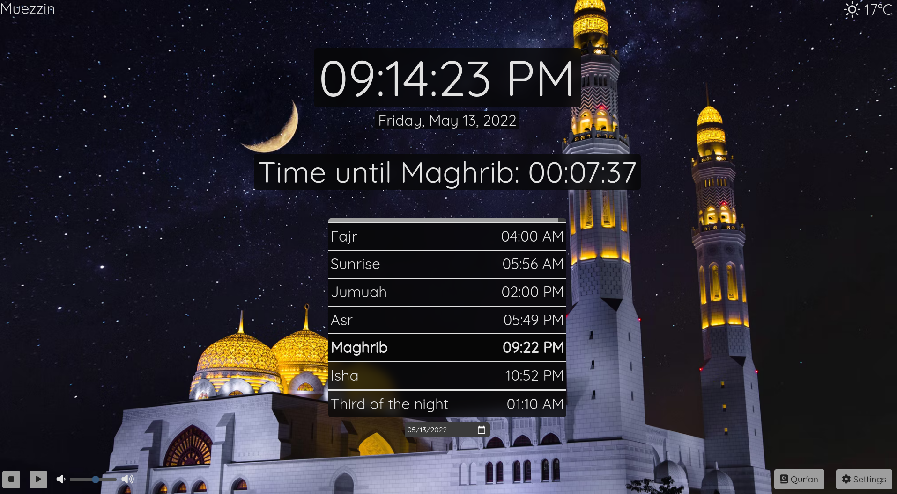

<!-- PROJECT SHIELDS -->
<!--
*** I'm using markdown "reference style" links for readability.
*** Reference links are enclosed in brackets [ ] instead of parentheses ( ).
*** See the bottom of this document for the declaration of the reference variables
*** for contributors-url, forks-url, etc. This is an optional, concise syntax you may use.
*** https://www.markdownguide.org/basic-syntax/#reference-style-links

[![Contributors][contributors-shield]][contributors-url]
[![Forks][forks-shield]][forks-url]
[![Stargazers][stars-shield]][stars-url]
[![Issues][issues-shield]][issues-url]
[![MIT License][license-shield]][license-url]
[![LinkedIn][linkedin-shield]][linkedin-url]
-->

<!-- PROJECT LOGO -->
 

  

  <h3 align="center">Muezzin - مؤذن</h3>

  

    A prayer times and Adhan application for Windows, macOS and GNU/Linux 
     
    <a href="https://github.com/DBChoco/MuezzinPrayerTimes/releases/latest"><strong>Download »</strong></a>
     
     
    <a href="https://github.com/DBChoco/MuezzinPrayerTimes">View Demo</a>
    ·
    <a href="https://github.com/DBChoco/MuezzinPrayerTimes/issues">Report Bug</a>
    ·
    <a href="https://github.com/DBChoco/MuezzinPrayerTimes/issues">Request Feature</a>
  

<!-- TABLE OF CONTENTS -->

  
Table of Contents

  <ol>
    <li>
      <a href="#about-the-project">About The Project</a>
      <ul>
        <li><a href="#supported-languages">Supported Languages</a></li>
        <li><a href="#built-with">Built With</a></li>
        <li><a href="#roadmap">Roadmap</a></li>
      </ul>
    </li>
    <li>
      <a href="#how-to-install">How To Install</a>
      <ul>
        <li><a href="#windows">Windows</a></li>
        <li><a href="#macos">macOS</a></li>
        <li><a href="#gnulinux">GNU/Linux</a>
          <ul>
            <li><a href="#arch-based-distributions">Arch based distributions</a></li>
            <li><a href="#debian-based-distributions">Debian based distributions</a></li>
            <li><a href="#others">Others</a></li>
          </ul>
        </li>
      </ul>
    </li>
    <li><a href="#contributing">Contributing</a></li>
    <li><a href="#license">License</a></li>
    <li><a href="#contact">Contact</a></li>
    <li><a href="#acknowledgments">Acknowledgments</a></li>
  </ol>

<!-- ABOUT THE PROJECT -->
## About The Project

  

We may all be familiar with Muslim Pro on our smartphones, but as someone who doesn't use my phone much, I wanted an app to help me keep track of prayer times without having to go on my smartphone, I wanted an app that was higly customizable and would let me choose <strong> my own </strong> Adhan and theme. And Alhamdoulillah after a few weeks of hard work, I did just that.

On Muezzin you can choose to play an Adhan or not, you can import your own audio file; you can also chose to have a background or not, and import your own.
Currently we support 10, and if you want us to add one more, you can submit a report  <a href="https://github.com/DBChoco/MuezzinPrayerTimes/issues">here</a>

  

<!-- SUPPORTED LANGUAGES -->
### Supported Languages
* English
* Français
* Español
* Italiano
* Arabic
* Deutsch
* Nederlands
* Norks
* Svenska
* Dansk
* Urdu

### Built With

This section should list any major frameworks/libraries used to bootstrap your project. Leave any add-ons/plugins for the acknowledgements section. Here are a few examples.

* [Electron](https://www.electronjs.org/)
* [Bootstrap](https://getbootstrap.com)
* [Bootstrap-dark-5](https://vinorodrigues.github.io/bootstrap-dark-5/)
* [adhan-js](https://github.com/batoulapps/adhan-js)
* [fontAwesome](https://fontawesome.com/)
* [Moment & Moment-timezone](https://momentjs.com/)
* [Many electron modules]

<!-- ROADMAP -->
### Roadmap

- [ ] Add mosque mode (improved visibility from afar & delays to prayers)
  - [ ] Mosque interface with delays
  - [ ] Manual times
  - [ ] Custom text 
- [x] Launch minimized
- [x] Add sunnah times
- [x] Fix German calendar
- [x] Prayer times adjustements
- [ ] Multi-language Support
    - [x] Urdu

See the [open issues](https://github.com/DBChoco/MuezzinPrayerTimes/issues) for a full list of proposed features (and known issues).

(<a href="#top">back to top</a>)

<!-- How to install -->
## How to install

### Windows
From the  <a href="https://github.com/DBChoco/MuezzinPrayerTimes/releases/latest"><strong>download page</strong></a>, select the .EXE installer.
Download it and install it. 

You might receive a warning, that is because the app is not signed and I do not have the money to do so. The app is completely safe, you can read through the source code or have a trusted friend do it for you, all the code is <b>Open-Source</b>.

### macOS
From the  <a href="https://github.com/DBChoco/MuezzinPrayerTimes/releases/latest"><strong>download page</strong></a>, select the .DMG installer.
Download it and install it. 

Same problem as the Windows installer
> You might receive a warning, that is because the app is not signed and I do not have the money to do so. The app is completely safe, you can read through the source code or have a trusted friend do it for you, all the code is <b>Open-Source</b>.

### GNU/Linux
#### Arch based distributions
You can either:
 <ul>
  <li><a href="https://github.com/DBChoco/MuezzinPrayerTimes/releases/latest"><strong>Download the .PACMAN file</strong></a> and install it through your favorite package manager</li>
  <li>Install it thorugh the AUR package <a href="https://aur.archlinux.org/packages/muezzin-bin"><strong>muezzin-bin</strong></a> with yay -S muezzin-bin
  </li>
</ul> 

#### Debian based distributions
You can download the <a href="https://github.com/DBChoco/MuezzinPrayerTimes/releases/latest"><strong>Download the .DEB file</strong></a> and install it through your favorite package manager

#### Others
For other distributions, on the <a href="https://github.com/DBChoco/MuezzinPrayerTimes/releases/latest"><strong>download page</strong></a> you can choose from:
 <ul>
  <li>The .APPIMAGE file, which you can run on any Linux distribution and add to your autorun script</li>
  <li>The .TAR.GZ file, which you can unarchive wherever you want and launch via the terminal</li>
</ul> 

(<a href="#top">back to top</a>)

<!-- CONTRIBUTING -->
## Contributing

Contributions are what make the open source community such an amazing place to learn, inspire, and create. Any contributions you make are **greatly appreciated**.

If you have a suggestion that would make this better, please fork the repo and create a pull request. You can also simply open an issue with the tag "enhancement".
Don't forget to give the project a star! Thanks again!

(<a href="#top">back to top</a>)

<!-- LICENSE -->
## License

Distributed under the MIT License. See `LICENSE.txt` for more information.

(<a href="#top">back to top</a>)

<!-- CONTACT -->
## Contact

Project Link: [https://github.com/DBChoco/Muezzin](https://github.com/your_username/repo_name)

(<a href="#top">back to top</a>)

<!-- ACKNOWLEDGMENTS -->
## Acknowledgments

* [Source of images](https://unsplash.com/)
* [Source of Mecca Adhan](https://www.youtube.com/watch?v=MaEzj5eRmjc&t)
* [Source of al-Aqsa Adhan](https://www.youtube.com/watch?v=z2xEwSi2vaI)
* [Source of Bismillah startup sound](https://www.youtube.com/c/FatihSeferagic/featured)
* [Inspiration for logo](https://www.youtube.com/watch?v=oM5hNuAmWs0)
* [Template for the README page](https://github.com/othneildrew/Best-README-Template)
* Thanks to a few of my friends for helping me translate Muezzin and build it for macOS

(<a href="#top">back to top</a>)

<!-- MARKDOWN LINKS & IMAGES -->
<!-- https://www.markdownguide.org/basic-syntax/#reference-style-links 
[contributors-shield]: https://img.shields.io/github/contributors/othneildrew/Best-README-Template.svg?style=for-the-badge
[contributors-url]: https://github.com/othneildrew/Best-README-Template/graphs/contributors
[forks-shield]: https://img.shields.io/github/forks/othneildrew/Best-README-Template.svg?style=for-the-badge
[forks-url]: https://github.com/othneildrew/Best-README-Template/network/members
[stars-shield]: https://img.shields.io/github/stars/othneildrew/Best-README-Template.svg?style=for-the-badge
[stars-url]: https://github.com/othneildrew/Best-README-Template/stargazers
[issues-shield]: https://img.shields.io/github/issues/othneildrew/Best-README-Template.svg?style=for-the-badge
[issues-url]: https://github.com/othneildrew/Best-README-Template/issues
[license-shield]: https://img.shields.io/github/license/othneildrew/Best-README-Template.svg?style=for-the-badge
[license-url]: https://github.com/othneildrew/Best-README-Template/blob/master/LICENSE.txt
[linkedin-shield]: https://img.shields.io/badge/-LinkedIn-black.svg?style=for-the-badge&logo=linkedin&colorB=555
[linkedin-url]: https://linkedin.com/in/othneildrew
[product-screenshot]: images/screenshot.png -->
